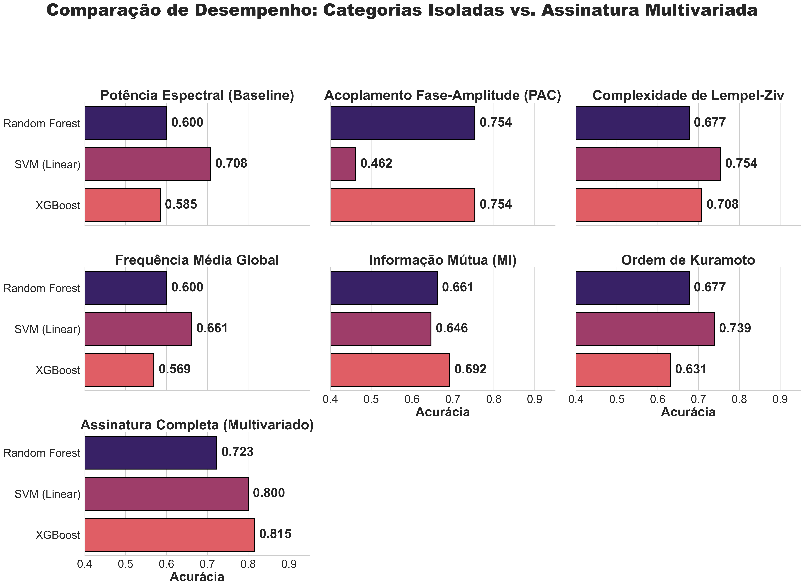
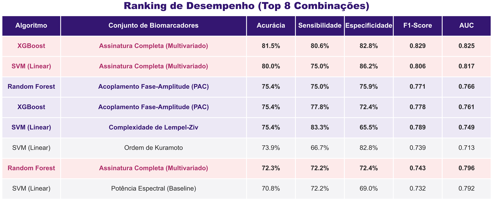

# Além Da Potência Espectral: Um Estudo Comparativo De Categorias De Biomarcadores De Eletroencefalograma Usando Aprendizado De Máquina Para Rastreio Da Doença De Alzheimer 

[](https://www.python.org/downloads/)
[](https://mne.tools/)
[](https://scikit-learn.org/)
[](https://xgboost.readthedocs.io/)

Este repositório contém o código-fonte, pipeline de processamento e análises visuais de um estudo computacional focado na classificação da Doença de Alzheimer (AD) versus Controles Saudáveis (CN) utilizando sinais de Eletroencefalograma (EEG). O projeto explora a eficácia de uma assinatura multivariada contrastada com biomarcadores isolados de lentificação, conectividade, complexidade e potência espectral.

---

## Objetivo do Projeto

Comparar sistematicamente o desempenho preditivo de categorias distintas de biomarcadores neurofisiológicos no rastreio da patologia sob idênticas condições experimentais, utilizando algoritmos de aprendizado de máquina (*Machine Learning*) validados de forma cruzada (Leave-One-Subject-Out).

---

## Base de Dados e Pré-Processamento

Os sinais utilizados são provenientes de um conjunto de dados público formatado no padrão BIDS, consistindo em aquisições de EEG de 19 canais (montagem 10-20) com frequência de amostragem de 500 Hz.

O pipeline de pré-processamento dos dados brutos foi rigorosamente desenhado com base na metodologia descrita por Miltiadous *et al.* (2023), envolvendo as seguintes etapas:

1. **Filtragem:** Aplicação de filtro passa-banda IIR (*Butterworth* de 4ª ordem) entre 0.5 e 45.0 Hz.

2. **Re-referenciamento:** Conversão para referência conectada nas mastoides/lóbulos das orelhas (A1, A2).

3. **Limpeza Contínua (ASR):** Utilização do algoritmo *Artifact Subspace Reconstruction* (ASR) para correção de artefatos de alta variância (limiar de desvio padrão = 17).

4. **Análise de Componentes Independentes (ICA):** Decomposição via algoritmo *Extended Infomax* (19 componentes) acoplado ao algoritmo **ICLabel** para identificação e rejeição automática de artefatos biológicos (piscadas e ruídos musculares/mandíbula).

5. **Segmentação (Epoching):** Divisão dos sinais limpos em janelas temporais de 4 segundos com 50% (2 segundos) de sobreposição.

---

## Extração de Características (Biomarcadores)

Para cada época do EEG, foram extraídos atributos computacionais cobrindo 5 bandas de frequência (Delta, Theta, Alpha, Beta, Gamma). A figura abaixo detalha o mapeamento entre os mecanismos patológicos e as métricas computacionais extraídas.

As categorias analisadas incluem:

- **Potência Espectral (Baseline):** Potência Relativa de Banda (RBP) via Método de Welch.

- **Lentificação (Slowing):** Frequência Média Global (Centro de massa espectral).

- **Complexidade Não-Linear:** Algoritmo de Lempel-Ziv (LZC) após binarização do sinal.

- **Conectividade Cerebral:** Acoplamento Fase-Amplitude (PAC) via Divergência de Kullback-Leibler.

- **Oscilações Sistêmicas:** Ordem de Sincronização de Kuramoto (Fasores instantâneos via Transformada de Hilbert).

- **Desorganização Funcional:** Informação Mútua (MI) medindo o compartilhamento de informação não-linear entre pares de eletrodos.

---

## Modelagem e Inteligência Artificial

A etapa preditiva utiliza um formato de extração matricial agregada, em que cada paciente contribui com a média global de suas épocas, assegurando estabilidade na inferência.

- **Algoritmos Testados:** *Random Forest* (RF), *Support Vector Machine* (SVM - Linear) e *XGBoost*.

- **Estratégia de Validação:** A fim de garantir a validade clínica e a eliminação completa de vazamento de dados (*data leakage*), o treinamento foi conduzido sob validação cruzada do tipo **Leave-One-Subject-Out (LOSO)**.

- **Métricas de Desempenho:** Acurácia, Sensibilidade, Especificidade, F1-Score e AUC-ROC.

---

## Principais Resultados

Os modelos provaram que a análise do cérebro como um sistema integrado (Assinatura Multivariada) supera largamente os métodos clássicos baseados em análises espectrais simples.

Abaixo, apresentamos o gráfico facetado de acurácia, que evidencia a supremacia da assinatura completa, seguido pelo ranking das combinações mais eficazes:

### Comparação de Desempenho



### Ranking de Desempenho



### Principais Conclusões

1. **Assinatura Completa (Multivariado) via XGBoost:** Alcançou o primeiro lugar absoluto no ranking com Acurácia de **81.5%** e AUC de **0.825**.

2. O biomarcador isolado com melhor desempenho foi a **Conectividade (PAC)** e a **Complexidade (Lempel-Ziv)**, ambos atingindo até **75.4%** de precisão (Random Forest e SVM, respectivamente).

3. Biomarcadores tradicionais, como **Potência Espectral** e **Slowing**, figuraram entre os piores desempenhos isolados na discriminação da patologia.

---

## Como Executar este Projeto

### 1. Clonando o Repositório e Preparando o Ambiente

Recomenda-se a utilização de um ambiente virtual (Anaconda ou venv).

```bash
git clone https://github.com/SharaIsabell/eeg-alzheimer-biomarkers-analysis.git
cd eeg-alzheimer-biomarkers-analysis
```

### 2. Instalando as Dependências

O pipeline faz uso primário do pacote `mne-python` e sub-módulos avançados de conectividade e artefatos.

```bash
pip install mne mne-icalabel meegkit antropy tensorpac scikit-learn scipy xgboost pandas matplotlib seaborn
```

### 3. Estrutura de Execução

O fluxo analítico está consolidado em dois *Jupyter Notebooks* principais:

- `preprocessingData.ipynb`: Responsável pelo carregamento dos dados BIDS, pipeline de pré-processamento (Filtros, ASR, ICA) e cálculo vetorial de todas as features neurofisiológicas para compor as tabelas de dados brutos (`eeg_features.csv`), pelo cruzamento dos dados com os diagnósticos (`eeg_features_for_ML.csv`), extração da baseline (`eeg_features_baseline_data.csv`).

- `models_training.ipynb`: Responsável pela execução do treinamento de IA com Validação LOSO e geração das métricas e recursos visuais.

---

## Estrutura do Diretório

```text
├── 88 subjects/                                    # Dataset BIDS Original (Pacientes e Controles)
├── images/                                         # Dashboards de performance individual de cada modelo
├── .gitignore                                      # Arquivos ignorados pelo Git
├── eeg_features.csv                                # Features extraídas
├── eeg_features_baseline_data.csv                  # Features com resultado para treinamento ML e métrica espectral de base (RBP)
├── eeg_features_for_ML.csv                         # Features com resultado para treinamento ML
├── grafico_banner_nova_paleta_titulos_gigantes.png 
├── models_training.ipynb                           # Script de Machine Learning e geração visual
├── preprocessingData.ipynb                         # Script de MNE-Python e processamento digital de sinais
├── resultados_modelos.csv                          # Resultados de todos os modelos
└── tabela_banner_fontes_gigantes.png               
```

---

## Referências

1. Miltiadous A, Tzimourta KD, Afrantou T, Ioannidis P, Grigoriadis N, Tsalikakis DG, et al. A Dataset of Scalp EEG Recordings of Alzheimer's Disease, Frontotemporal Dementia and Healthy Subjects from Routine EEG. *Data*. 2023;8:95. doi:10.3390/data8060095.
